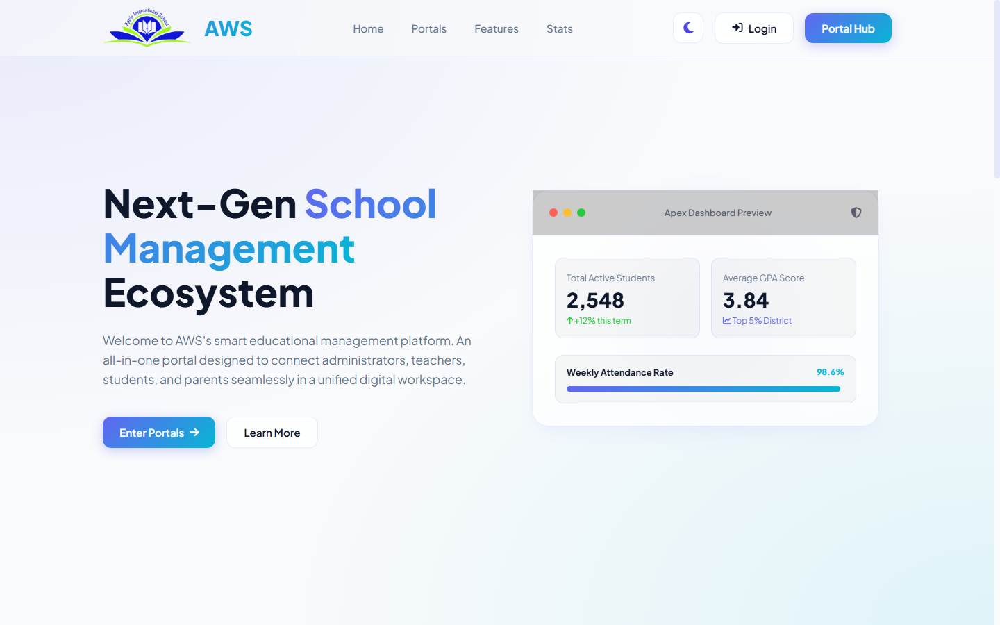
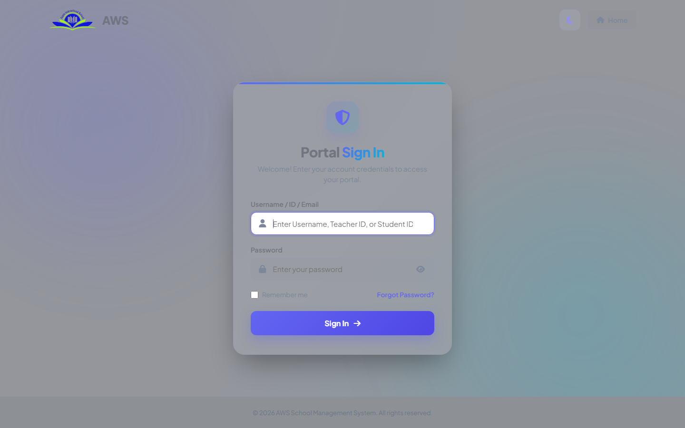
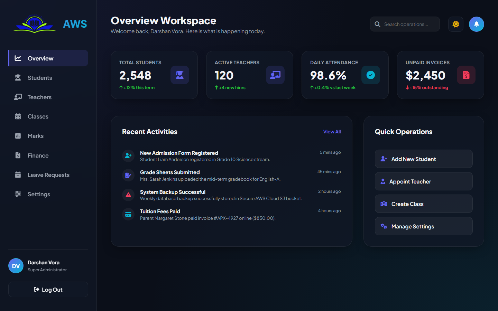
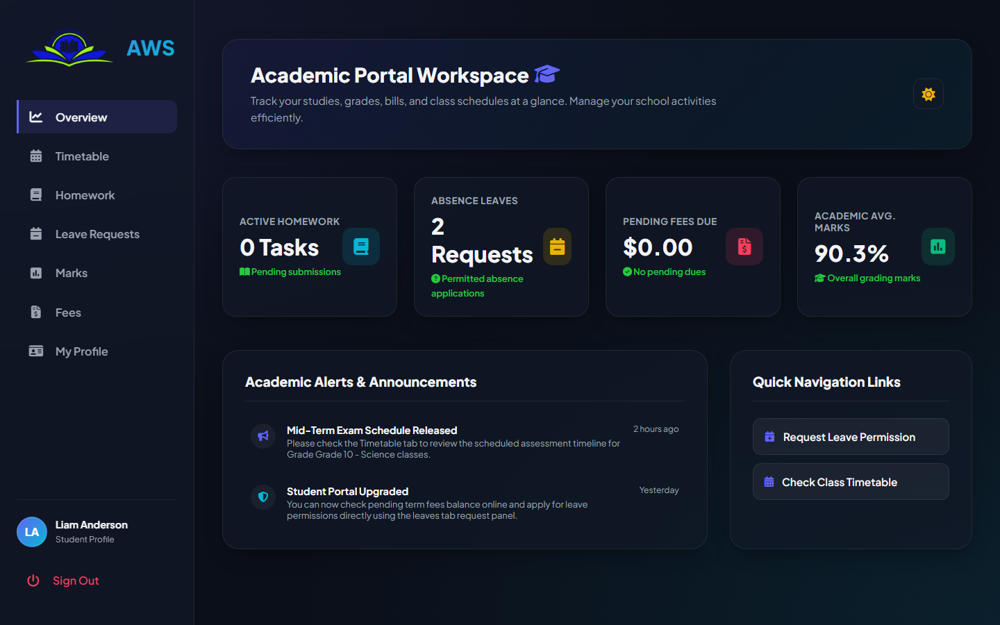
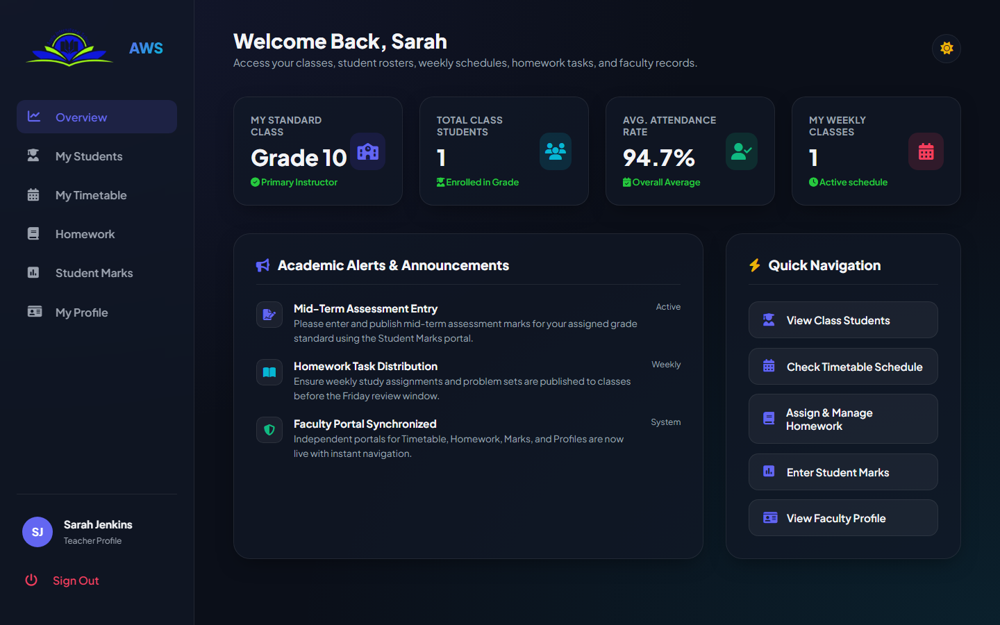
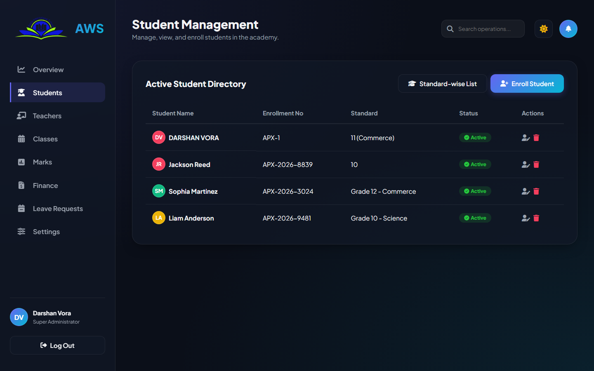
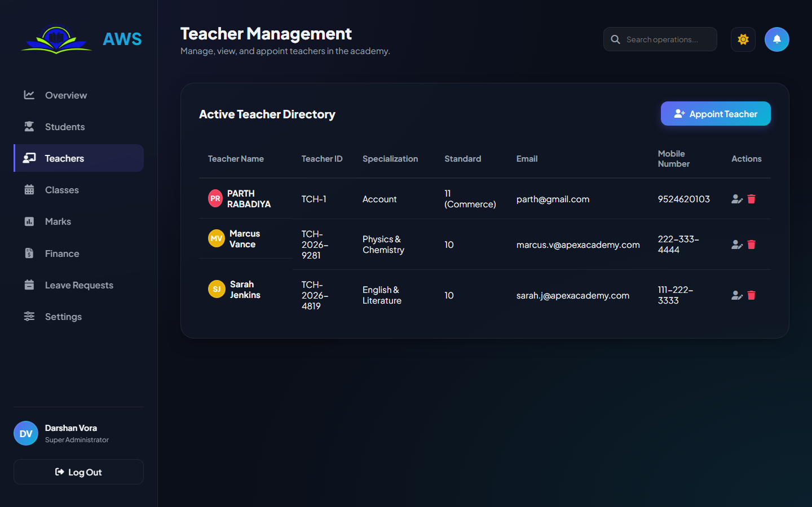
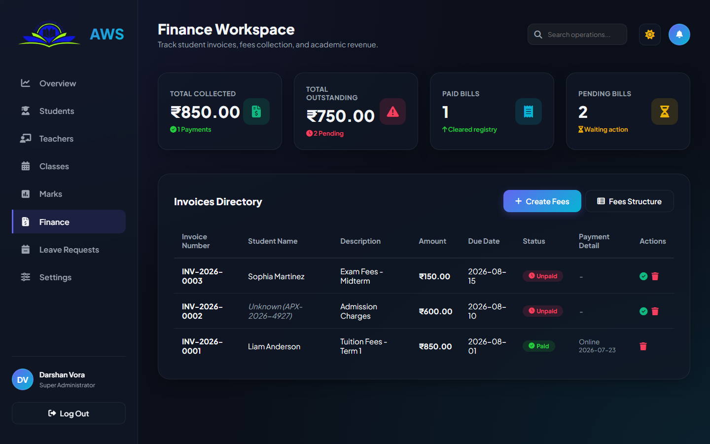
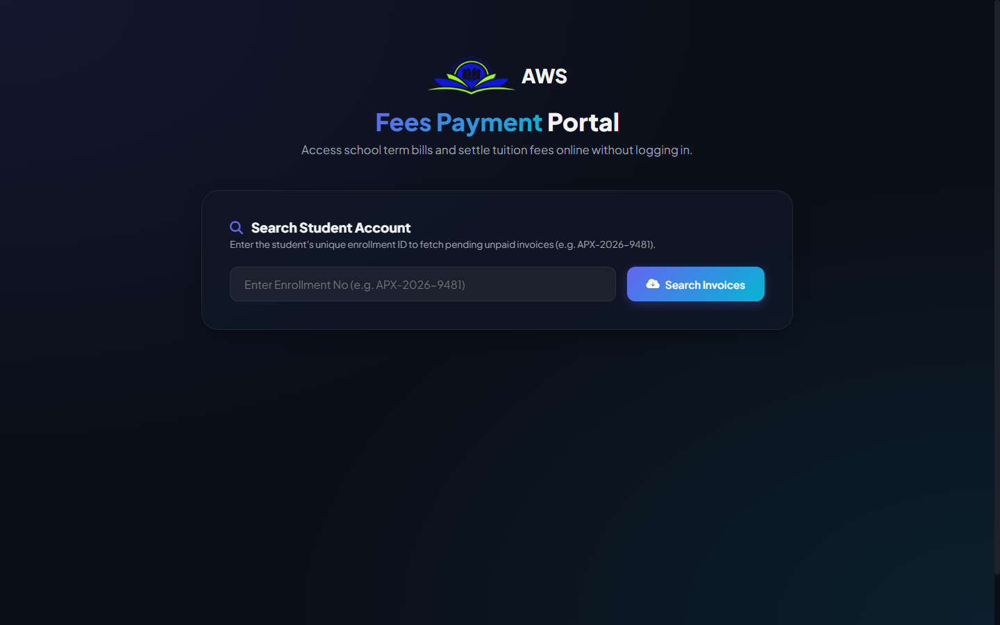
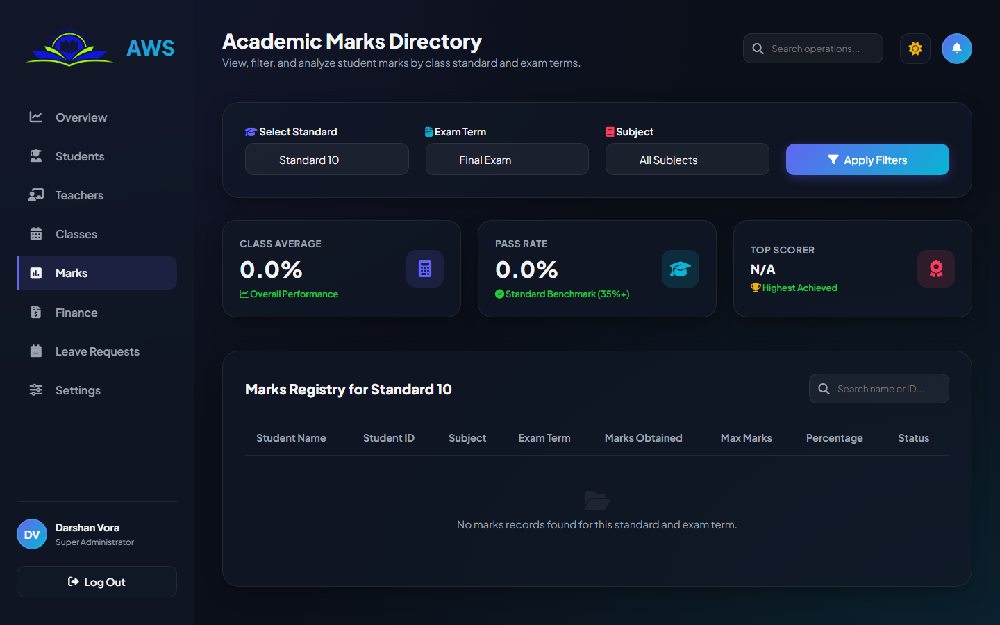

# 🎓 School Management System (SMS) - AWS Education Ecosystem

[](https://www.php.net/)
[](https://www.mysql.com/)
[](https://www.apachefriends.org/)
[](https://developer.mozilla.org/en-US/docs/Web/JavaScript)
[](LICENSE)

A modern, responsive, and full-featured **School Management System (SMS)** built with **PHP & MySQL**. Designed with an elegant dark glassmorphism interface, real-time KPI tracking, and dedicated portals for **Administrators**, **Teachers**, **Students**, and **Parents**.

---

## 📸 Screenshots Showcase

### 1. 🌐 Landing Page
Modern landing page introducing the educational ecosystem, portal categories, core highlights, and key metrics.


---

### 2. 🔐 Unified Login Portal
Secure authentication gateway featuring role-based redirection, instant verification, and password toggle.


---

### 3. 👑 Administrator Workspace & Overview
Executive dashboard featuring student/teacher headcount KPI cards, real-time attendance rate, finance trends, activity feeds, and quick operational shortcuts.


---

### 4. 👨‍🎓 Student Portal Workspace
Empowers students to track active homework assignments, attendance history, term report cards, timetable schedules, and fee balance invoices.


---

### 5. 👩‍🏫 Teacher Portal Workspace
Equips instructors with roster overviews, gradebook mark submission, assignment distribution, and weekly schedule tracking.


---

### 6. 👥 Student Directory & Management
Comprehensive directory supporting student profile creation, updates, attendance percentage computation, and advanced filtering.


---

### 7. 🧑‍🏫 Faculty & Teacher Directory
Roster manager for appointing, updating, and organizing faculty members by subject specialization and assigned standards.


---

### 8. 💳 Finance, Billing & Invoicing
Centralized finance dashboard to monitor paid vs unpaid tuition invoices, revenue totals, and invoice status updates.


---

### 9. 💰 Student Fee Payment Portal
Public-facing secure invoice lookup and payment gateway for students and parents to settle school tuition fees.


---

### 10. 📊 Academic Gradebook & Marks Management
Marks assessment portal for teachers and admins to assign exam scores, calculate GPA/percentages, and publish student report cards.


---

## ✨ Key Features

- **🔐 Multi-Role Authentication**: Dedicated access control for Admins, Teachers, Students, and Parents.
- **📈 Real-Time KPIs & Analytics**: Instant counts of active students, faculty, attendance rates, and billing stats.
- **🧑‍🎓 Student Information System (SIS)**: Full CRUD operations for student admission, bio-data, academic standards, and guardian contacts.
- **👩‍🏫 Faculty Roster Management**: Organize teachers by subject specialization and assigned classes.
- **📅 Class & Timetable Management**: Schedule class routines, assign classrooms, and organize subjects.
- **📝 Homework & Assignment Distribution**: Publish homework assignments, deadlines, and track submissions.
- **📝 Attendance & Leave Application**: Submit student leave applications and review approval status.
- **💵 Fees & Tuition Portal**: Issue invoices, track overdue payments, and manage payment receipts.
- **🌙 Glassmorphic UI/UX**: Sleek, modern, responsive dark-themed dashboard powered by custom CSS.

---

## 🛠️ Tech Stack

- **Backend**: PHP 8.x (Procedural & Object-Oriented with MySQLi prepared statements)
- **Database**: MySQL / MariaDB (`sms_db`)
- **Frontend**: HTML5, Vanilla CSS3, ES6+ JavaScript
- **Icons**: FontAwesome 6
- **Server Environment**: Apache / XAMPP

---

## 🚀 Getting Started

### Prerequisites
- [XAMPP](https://www.apachefriends.org/) (with PHP 8.0+ and MySQL / MariaDB)
- A modern web browser (Google Chrome, Microsoft Edge, Mozilla Firefox)
- [Git](https://git-scm.com/) installed

### 1. Clone the Repository
Clone into your XAMPP `htdocs` directory:
```bash
cd C:/xampp/htdocs/
git clone https://github.com/Dsvora2006-cyber/School-Management-System.git sms
```

### 2. Configure Database
1. Open the **XAMPP Control Panel** and start **Apache** and **MySQL**.
2. Open [phpMyAdmin](http://localhost/phpmyadmin) in your browser.
3. Import the included database dump:
   - Create a database named `sms_db` (or allow `db_connect.php` to auto-create it).
   - Import `sms_db.sql` into `sms_db`.
4. Check connection parameters in [`db_connect.php`](db_connect.php):
   ```php
   $host = 'localhost';
   $user = 'root';
   $password = '';
   $dbname = 'sms_db';
   ```

### 3. Launch Application
Visit the project in your browser:
```text
http://localhost/sms/
```

---

## 🔑 Default Credentials

| Role | Username / ID / Email | Password |
| :--- | :--- | :--- |
| **Super Admin** | `jeel` / `jeel@gmail.COM | `123` |
| **System Admin** | `harshil` / `harshil@gmail.com` | `123` |
| **Teacher** | `TCH-1` / `TCH-2026-4819` | `123` |
| **Student** | `APX-1` / `APX-2026-9481` | `123` |

---

You can any time change the passwords using forgot password.
Student email id:- Student enrollment number is student login email id
Teacher email id:-teacher Id  is teacher id is teacher login email id


## 📁 Project Directory Structure

```text
sms/
├── images/                      # Project logos and image assets
│   └── logo.png
├── screenshots/                 # High-resolution screenshots of the UI
│   ├── 01_landing_page.png
│   ├── 02_login_portal.png
│   ├── 03_admin_dashboard.png
│   ├── 04_student_dashboard.png
│   ├── 05_teacher_dashboard.png
│   ├── 06_student_management.png
│   ├── 07_teacher_management.png
│   ├── 08_finance_billing.png
│   ├── 09_fees_payment_portal.png
│   └── 10_academic_marks.png
├── admin_dashboard.php          # Admin overview workspace
├── admin_header.php             # Admin layout header & session security
├── admin_sidebar.php            # Admin sidebar navigation
├── admin_top_panel.php          # Admin top bar with user profile
├── auth_login.php               # Unified login processing endpoint
├── cfinance.php                 # Finance and billing manager
├── class.php                    # Class management workspace
├── db_connect.php               # Database connection and schema initializer
├── fees_payment_portal.php      # Student fee payment portal
├── homework.php                 # Homework manager
├── index.php                    # Public landing page
├── login.php                    # Login page
├── marks.php                    # Academic marks management
├── settings.php                 # System configuration settings
├── student.php                  # Student directory and registration
├── student_dashboard.php        # Student portal workspace
├── teacher.php                  # Teacher directory and appointment
├── teacher_dashboard.php        # Teacher portal workspace
├── time_table.php               # Class schedule and timetable
├── style.css                    # Main design system styles
├── app.js                       # Frontend UI logic and modal interactions
├── sms_db.sql                   # Full MySQL database backup dump
├── .gitignore                   # Git ignore configuration
└── README.md                    # Project documentation
```

---

## 👤 Author

Developed by **[Darshan Vora](https://github.com/Dsvora2006-cyber)**  
- GitHub: [@Dsvora2006-cyber](https://github.com/Dsvora2006-cyber)
